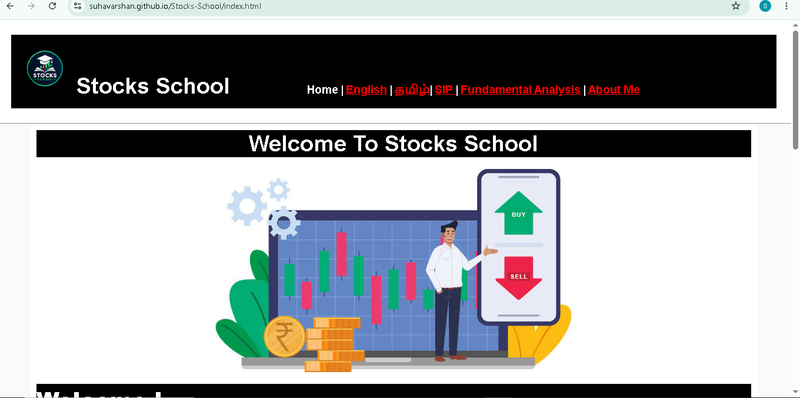

# 📈 Stocks School

### Learn Stock Market Basics & Fundamentals

**Stocks School** is a beginner-friendly educational website designed to help learners understand the fundamentals of the stock market in a simple and structured way.

🌐 **Live Website:** [Stocks School](https://suhavarshan.github.io/Stocks-School/)

---

## 🌐 Website Preview

<p align="center">
  
</p>


---

## 📚 About the Project

Stocks School is a web development project created to present stock-market concepts in an easy-to-understand format.

The website covers topics such as:

* 📊 Stock Market Basics
* 💹 Shares & Investing
* 🏦 Demat Accounts
* ⚖️ Trading vs Investing
* 📈 Fundamental Analysis
* 📉 Technical Analysis
* 💰 SIP — Systematic Investment Plan
* 🌐 English & Tamil educational content

The goal is to make financial concepts easier for beginners to understand through simple explanations and organized content.

---

## ✨ Features

* 📱 Responsive website design
* 🌐 English and Tamil content
* 📚 Beginner-friendly explanations
* 📊 Stock-market educational topics
* 🎨 Clean and simple UI
* 🚀 Hosted using GitHub Pages
* 🔗 Easy navigation between pages

---

## 🛠️ Technologies Used

| Technology       | Purpose                       |
| ---------------- | ----------------------------- |
| **HTML5**        | Website structure             |
| **CSS3**         | Styling and responsive design |
| **GitHub Pages** | Website hosting               |

---

## 📂 Project Structure

```text
Stocks-School/
│
├── index.html
├── About me.html
├── Fundamental Analysis .html
├── Fundamental Analysis in Tamil.html
├── style.css
├── images/
│
└── README.md
```

---

## 🎯 Project Goals

The main goals of Stocks School are to:

* Help beginners understand stock-market concepts.
* Present information in a simple and organized way.
* Provide educational content in both English and Tamil.
* Improve my practical skills in web development.
* Learn by building and publishing a real website.

---

## 🚀 Deployment

The website is deployed using **GitHub Pages**.

🔗 **Live Website:**
https://suhavarshan.github.io/Stocks-School/

---

## 📌 Disclaimer

Stocks School is an **educational project** created to explain basic stock-market concepts.

It does not provide financial advice, investment recommendations, or promote any particular investment.

---

## 👨‍💻 Developer

**Suhavarshan**

Built while learning and improving web development skills.

> **Code • Build • Learn • Repeat**

---

⭐ If you find this project useful, consider giving the repository a star!
